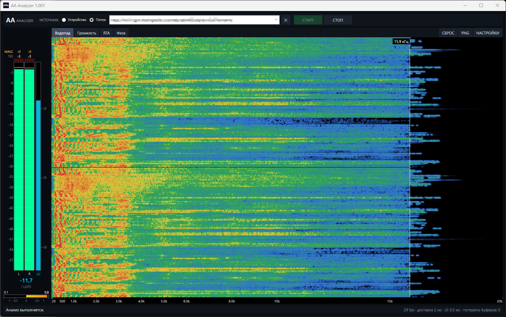
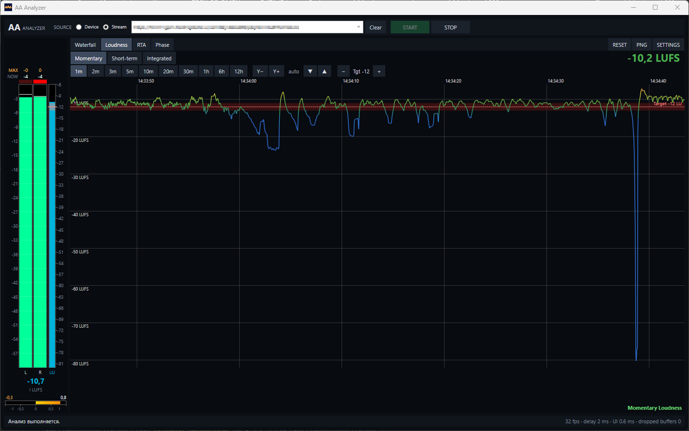
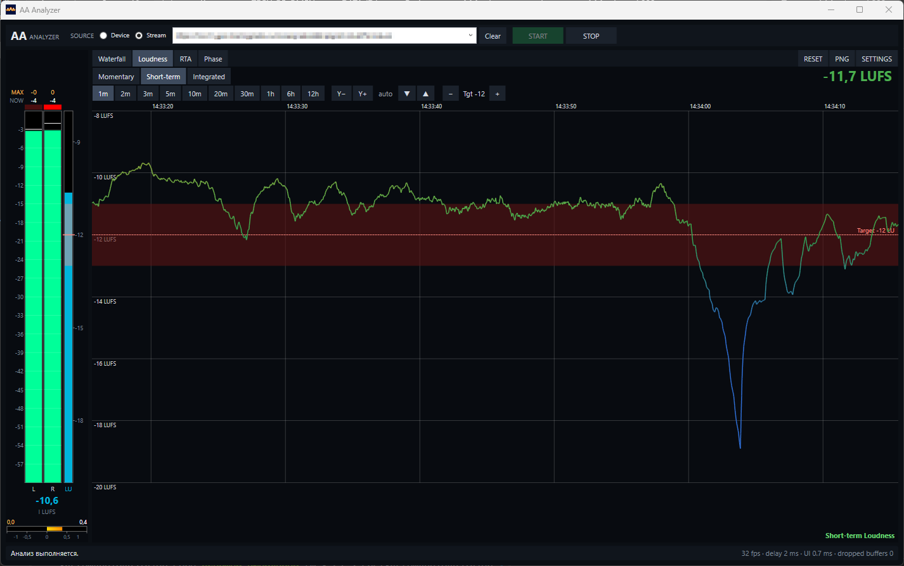
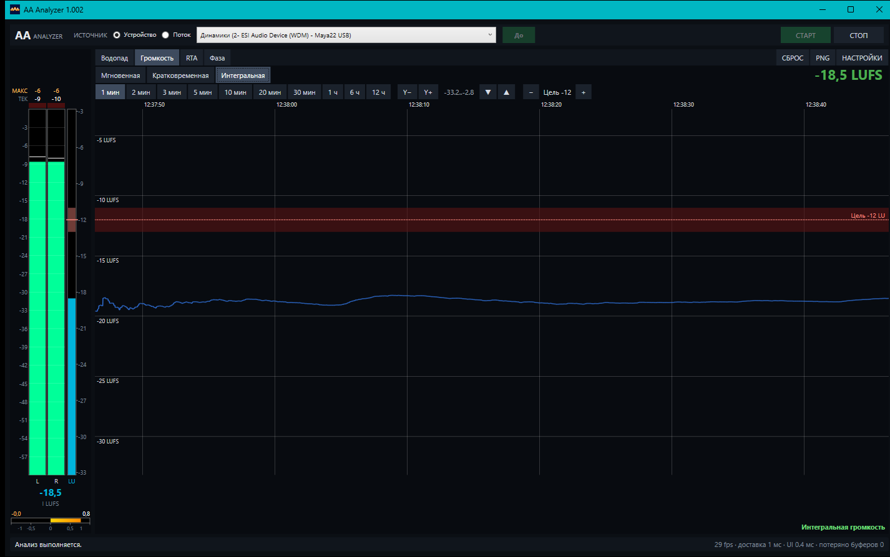
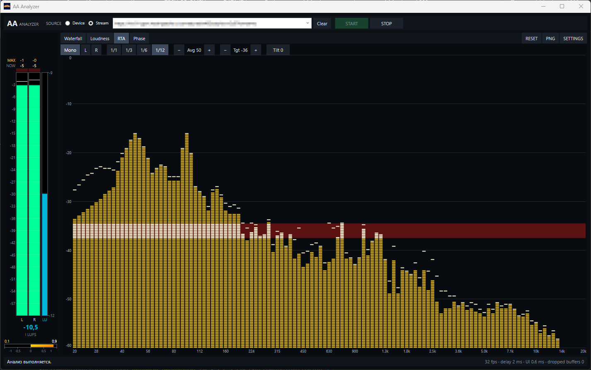
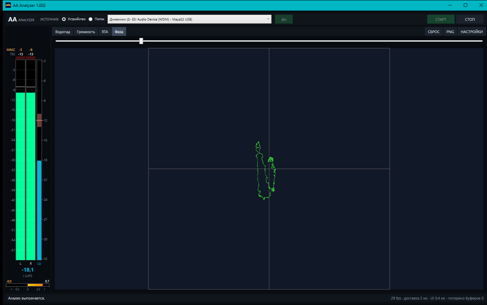

# AAAnalyzer

🇷🇺 Русский · [🇬🇧 English](README.md)

Портативный анализатор звука для Windows: показывает спектр, громкость и фазу
системного звука или сетевого потока (Icecast / HLS) в реальном времени. Ничего
не нужно устанавливать: ни драйвера, ни виртуального аудиокабеля.

## Что умеет

### Источники звука

- **Устройство** — системный микс выбранного устройства вывода через WASAPI loopback. Воспроизведение в колонках или наушниках не нарушается. ASIO не поддерживается!
- **Поток** — HTTP/HTTPS-адрес Icecast или HLS (`.m3u8`), декодирует LibVLC.

### Панель индикаторов уровней (слева)

- Peak-индикаторы каналов L и R со шкалой в dB.
- LU-индикатор громкости Integrated LUFS. Его вертикальная шкала совпадает со шкалой графика Loudness: 0 и минимум находятся на тех же высотах, шаг меток 3 LU.
- Индикатор фазы (корреляция L/R от −1 до +1).

### Режимы (вкладки)

- **Waterfall** — стерео-водопад: левый канал вверху, правый внизу.



- **Loudness** — график истории громкости по времени.
  - Метрики: Momentary, Short-Term, Integrated.
  - Окно: 1 мин … 12 ч; масштаб по Y (Y−/Y+), сдвиг (▼/▲) или автомасштаб.
  - Target line: (по умолчанию −23 LU) с полосой допуска ±3 LU.
  - Расчёт: по ITU-R BS.1770 (K-взвешивание, абсолютный и относительный пороги).







- **RTA** — спектр-анализатор
  - полосы 1/1, 1/3, 1/6, 1/12 октавы
  - источник Mono / L / R,
  - усреднение (1, 10, 20, …).
  - Target line: (по умолчанию −23 LU) с полосой допуска ±3 LU



- **Phase** — фазоскоп с регулировкой усиления.



Кнопки в строке вкладок: **СБРОС** (все измерения и графики), **PNG**
(скриншот текущей вкладки в `Screenshots\`), **НАСТРОЙКИ**.

### Язык интерфейса

English или Русский: переключатель в верхней части окна настроек, применяется сразу.
Выбор сохраняется в `Data\App.json`. При первом запуске берётся язык системы.

### Настройки и профили

Окно настроек охватывает:
  - FFT (размер, окно, шкалы),
  - Waterfall (пороги и палитра),
  - индикаторы,
  - Loudness,
  - RTA
  - Phase.
Наборы настроей хранятся в профилях (`Data\profiles.json`): можно сохранить под именем, удалить, назначить профиль по умолчанию. Изменения кнопками на панелях (метрика, окно, цель, RTA)
сохраняются в профиль по умолчанию автоматически.

## Требования

- Windows 10/11.
- Для запуска готовой сборки ничего не нужно (.NET и LibVLC входят в неё).
- Для сборки из исходников: [.NET 8 SDK](https://dotnet.microsoft.com/download/dotnet/8.0)
  с поддержкой Windows Desktop (WPF).

## Запуск готовой сборки

Распакуйте архив `AAAnalyzer-<версия>.zip` в папку куда угодно и запустите
`AAAnalyzer.exe`. Рядом с программой создаются:

| Путь | Содержимое |
|---|---|
| `Data\profiles.json` | профили настроек |
| `Data\App.json` | язык интерфейса |
| `Data\stream-history.json` | история адресов потоков |
| `logs\AAAnalyzer.log` | журнал работы |
| `Screenshots\` | PNG-скриншоты вкладок |

## Сборка из исходников

```powershell
git clone https://github.com/ykmn/AAAnalyzer
cd AAAnalyzer

# отладочная сборка и тесты
dotnet build
dotnet test

# запуск без публикации
dotnet run --project src\SystemAudioAnalyzer.App
```

### Портативная сборка (.exe)

```powershell
# версия берётся из VERSION.txt, формат «1.012 - 2026.10.08»
.\release\rebuild.ps1                              # win-x64
.\release\rebuild.ps1 -RuntimeIdentifier win-arm64 # ARM64
```

Скрипт выполнит `dotnet publish` (Release, self-contained, без одного файла) в
`release\AAAnalyzer-<версия>`, уберет лишние локализации (оставит только `en` и `ru`)
и проверит, что в сборке есть `AAAnalyzer.exe` и `libvlc.dll`. Готовую папку
можно переносить на другой компьютер целиком.

История изменений — в [CHANGELOG.md](CHANGELOG.md).

## Структура репозитория

```text
SystemAudioAnalyzer.sln
src/
  SystemAudioAnalyzer.Core/        движок: захват, уровни, True Peak, LUFS, FFT
  SystemAudioAnalyzer.App/         WPF-интерфейс, источники WASAPI и LibVLC, настройки
  SystemAudioAnalyzer.Diagnostic/  консольная утилита: список устройств вывода
tests/
  SystemAudioAnalyzer.Core.Tests/  тесты движка и измерителей
  SystemAudioAnalyzer.App.Tests/   тесты интерфейсной логики, настроек и отрисовки
release/
  rebuild.ps1                      сборка портативной версии
```

### Как устроен поток данных

```text
WASAPI loopback / LibVLC
  → очередь (~4 с звука)
  → равные порции, воспроизведение по часам аудио (~30 кадров/с)
  → LevelMeter, TruePeak, LoudnessMeter, SpectrumAnalyzer (FFT)
  → AnalysisFrame (неизменяемый снимок)
  → WPF-представления
```

Сетевые источники отдают звук пачками (примерно по полсекунды), поэтому движок
проигрывает его в темпе аудио, а не по мере поступления: кадры идут ровно и
звук не теряется.

## Благодарности

Идея интерфейса навеяна плагином Spectrum Tool DSP для WinAMP.
